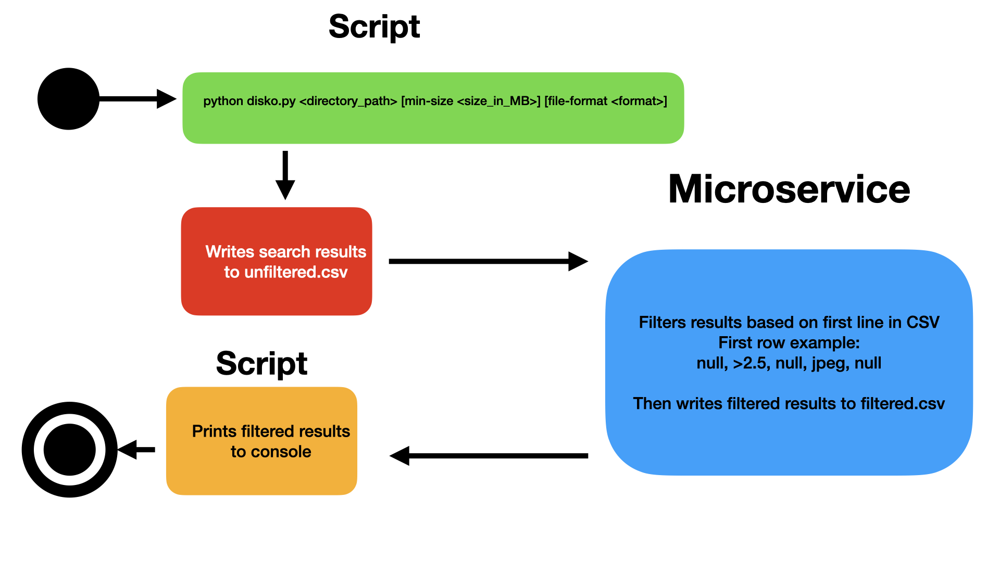

# disko-cli

To use this script, the user can filter by size, file format, and date: 
- Usage: python disko.py <directory_path> [min-size <size_in_MB>] [file-format <format>] [newer-than <date>]

[Example CSV output](example-csv/unfiltered.csv) 

