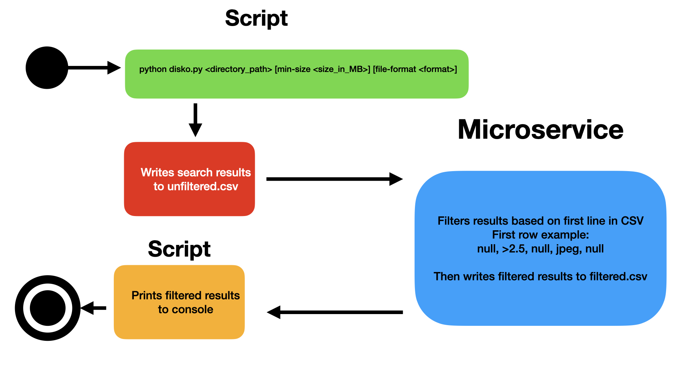

# disko-cli

To use this script, there are two possible ways to filter files. Either by size, or by file format: 
- python disko.py <directory_path> [min-size <size_in_MB>]
- python disko.py <directory_path> [file-format <format>]

[Example CSV output](example-csv/search_results.csv) 

